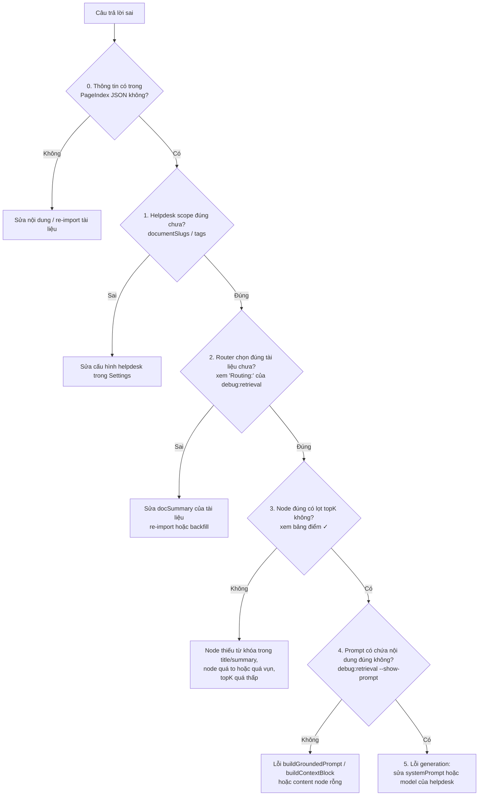

# RAG Debugging Guide — OmniAssist-RAG

Quy trình chẩn đoán khi chat trả lời sai, phỏng theo "RAG Debugging Decision Tree"
(`.claude/.temp/img/rag_tree.png`) nhưng viết lại cho pipeline **vectorless** của project:

```
route (chọn tài liệu) → retrieve (chấm điểm lexical) → prompt → generate
```

Nguyên tắc gốc giữ nguyên: **đừng bắt đầu từ LLM — bắt đầu từ evidence mà nó nhận được.**

Khác với cây gốc:

- Không có nhánh embeddings / vector index (`Rebuild embeddings`, `Rebuild index`) — hệ thống này không dùng vector, retrieval là chấm điểm lexical trên node PageIndex.
- Thêm bước **doc routing** (cây gốc không có): với helpdesk nhiều tài liệu, LLM chọn tài liệu trước khi retrieval chạy, nên đây là điểm hỏng mới cần kiểm tra sớm.

## Công cụ chính

```bash
npm run debug:retrieval -- --helpdesk tech-support "câu hỏi bị trả lời sai"
```

> **Windows PowerShell 5.1:** dấu `--` trần bị PowerShell nuốt mất trước khi tới npm,
> khiến `--helpdesk` bị npm hiểu nhầm là config. Phải quote nó:
> `npm run debug:retrieval '--' --helpdesk tech-support "câu hỏi"`

In ra: scope của helpdesk → danh sách tài liệu ứng viên → quyết định routing → bảng điểm
từng node (✓ = node thực sự được đưa vào prompt). Flags:

| Flag | Ý nghĩa |
| --- | --- |
| `--slugs a,b` / `--tags x,y` | Chỉ định scope trực tiếp thay vì lấy từ helpdesk |
| `--no-route` | Bỏ qua LLM routing (không tốn API call), chấm điểm trên mọi ứng viên |
| `--top 30` | Số dòng bảng điểm hiển thị (mặc định 15) |
| `--show-prompt` | In nguyên văn prompt cuối gửi cho model |

## Cây quyết định



## Checklist từng bước

### 0. Thông tin có trong tài liệu nguồn không?

Tương đương `Correct info in source docs?` của cây gốc. Kiểm tra nội dung node trong
PageIndex JSON (admin UI `/admin/documents` hoặc collection `pageindex_nodes` trong Mongo).
Nếu tài liệu nguồn sai/thiếu → sửa JSON và re-import, mọi bước sau vô nghĩa.

### 1. Helpdesk scope

Helpdesk giới hạn tài liệu qua `documentSlugs` (ưu tiên) hoặc `tags`
(`listReadyDocuments`, `apps/web/lib/server/repository.ts`). Tài liệu phải có
`status: "ready"`. Dòng đầu output của `debug:retrieval` in đúng scope đang dùng —
nếu tài liệu chứa câu trả lời không nằm trong "Candidate documents" thì sửa cấu hình
helpdesk, chưa cần nhìn xa hơn.

### 2. Doc routing (bước không có trong cây gốc)

Với >1 tài liệu ứng viên, `routeDocuments` (`apps/web/lib/server/doc-router.ts`) cho LLM
đọc `slug + title + tags + docSummary` và chọn tối đa 4 tài liệu. Nếu routing chọn sai:

- Kiểm tra `docSummary` của tài liệu (cột `docSummary: yes/NO` trong output). Summary
  thiếu hoặc mô tả kém → router không có căn cứ. Sửa bằng re-import (summary tự sinh)
- Lỗi LLM/JSON khi routing **không làm hỏng câu trả lời** — router fallback về tất cả
  ứng viên (xem `console.warn` trong log server).
- So sánh nhanh: chạy lại với `--no-route` — nếu kết quả tốt hơn thì thủ phạm là routing.

> **Hội thoại nhiều lượt:** câu follow-up được LLM viết lại thành câu hỏi độc lập
> (`question-rewriter.ts`) trước khi routing/retrieval chạy — server log in dòng
> `Follow-up rewritten for retrieval: "..." -> "..."`. Khi debug một câu follow-up,
> lấy **câu đã viết lại** trong log đưa vào `debug:retrieval` (CLI không có lịch sử).
> Nếu bản viết lại sai nghĩa thì lỗi nằm ở bước rewrite, chưa cần nhìn retrieval.

### 3. Retrieval — node đúng có lọt topK không?

Tương đương `Correct chunks retrieved?`. Bảng điểm của `debug:retrieval` hiển thị cả
những node **suýt lọt**, để thấy node đúng thua node nào và thua bao nhiêu điểm.

Cách chấm điểm (`scoreCandidates`, `apps/web/lib/server/retrieval.ts`) — mỗi term của
câu hỏi (bỏ dấu tiếng Việt, ≥2 ký tự, tối đa 16 term):

| Khớp ở đâu | Điểm |
| --- | --- |
| title | +8 |
| path | +4 |
| summary | +4 |
| content | min(số lần, 3) × 2 |

Điểm term × trọng số IDF (term hiếm trong tập node được ưu tiên), cộng thêm
coverage bonus `(matchedIdf/totalIdf) × 15`, phrase bonus nguyên câu 18/10/5
(title/summary/content), và +0.5 cho node level ≤ 1 đã có match. Chỉ node `score > 0`
được giữ, cắt ở `topK` (clamp 1..12, mặc định 6).

Nếu node đúng bị loại, các nguyên nhân thường gặp:

- **Title/summary của node không chứa từ khóa người dùng hay hỏi** → sửa title node
  trong PageIndex JSON (title nặng nhất: +8).
- **Node quá to** (nhiều chủ đề gộp một node — tương đương "chunks too big" của cây gốc)
  hoặc **quá vụn** (từ khóa rải rác nhiều node nhỏ) → chia/gộp lại node trong JSON.
- **topK quá thấp** so với độ rộng câu hỏi → tăng `topK` của helpdesk.
- **Câu hỏi dùng từ đồng nghĩa** không xuất hiện trong tài liệu → retrieval lexical
  không tự hiểu đồng nghĩa; thêm từ đó vào summary của node.

Phần thuần logic (flatten, scoring, extract ảnh) đã có unit tests: `npm run test`.

### 4. Prompt có chứa context đúng không?

Tương đương `Prompt included context?`. Chạy `--show-prompt` và tìm nội dung cần thiết
trong khối `PageIndex context`. Node lọt topK nhưng nội dung không xuất hiện trong
prompt → lỗi ở `buildGroundedPrompt` / `buildContextBlock` hoặc `content` node rỗng.

### 5. Prompt đủ mà trả lời vẫn sai — lỗi generation

Tương đương `Model followed context?`. Evidence đã đúng, vấn đề nằm ở model:

- Sửa `systemPrompt` của helpdesk (thêm ràng buộc cụ thể cho miền câu hỏi đó).
- Đổi `model` của helpdesk sang model mạnh hơn.
- Nếu model trả lời từ kiến thức ngoài thay vì context → siết thêm rule trong
  `buildGroundedPrompt` (`apps/web/lib/server/gemini.ts`).
